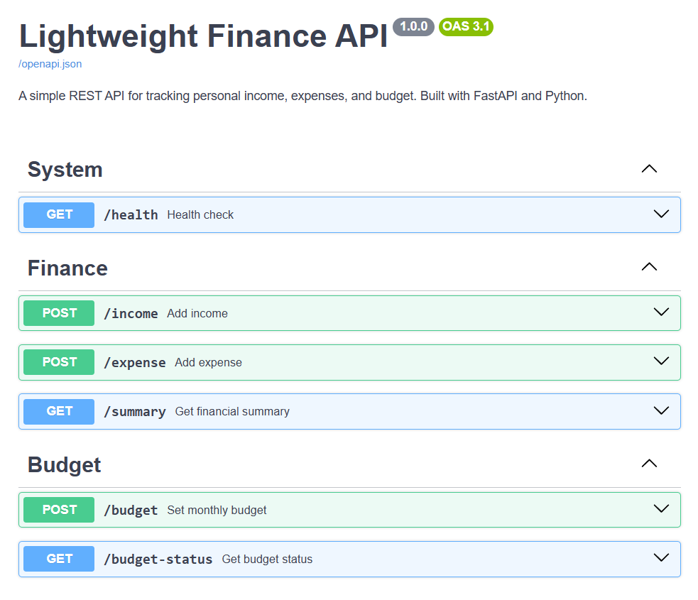
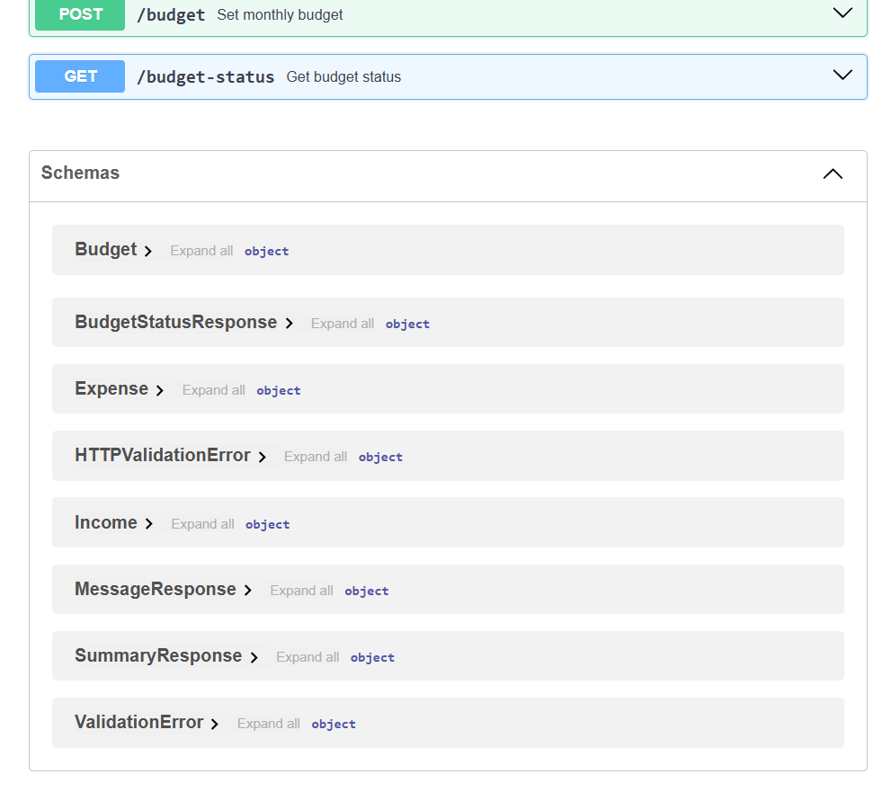
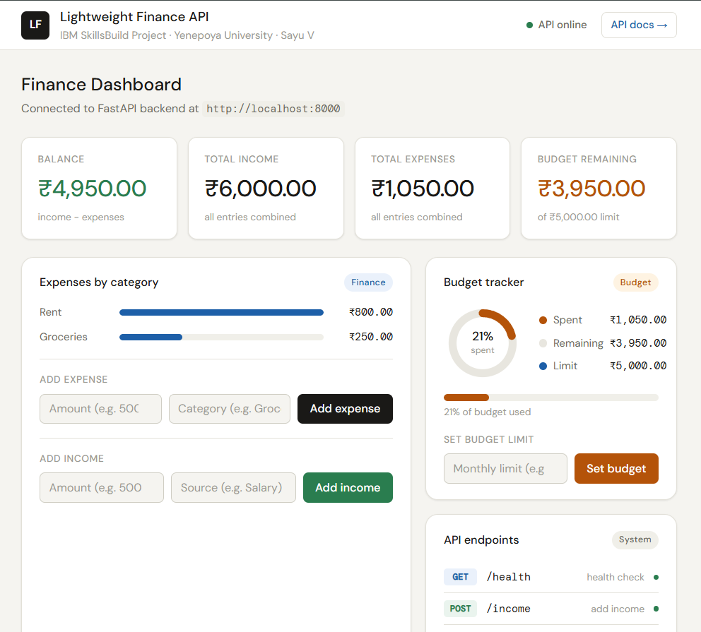
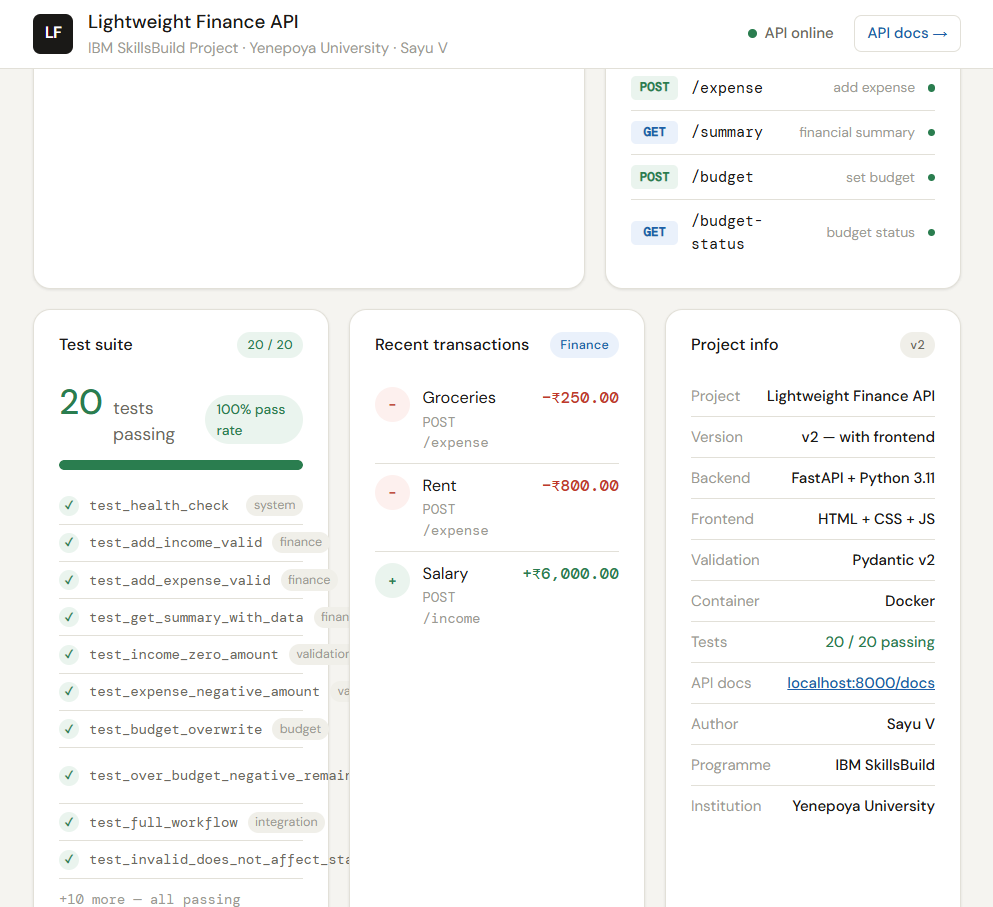

# Lightweight Finance API

A simple and lightweight REST API for tracking personal income, expenses, and budget — built with **FastAPI** and **Python**, containerised with **Docker**, with a frontend dashboard.

**IBM SkillsBuild Student Project · Yenepoya (Deemed to be University) · 2023–2026 Batch · Sayooj V**  
**Campus ID: 26067 · Registration ID: 23BCAICD096**

---

## Screenshots

### Backend — Swagger UI (API Documentation)



*All 6 endpoints grouped by tag — System, Finance, Budget — with OAS 3.1 schema*



*Auto-generated Pydantic response models — Budget, BudgetStatusResponse, Expense, Income, MessageResponse, SummaryResponse*

### Frontend Dashboard (v2)



*Live stat cards, expense bar chart, budget ring tracker, and API endpoint status panel*



*20/20 test suite results, recent transactions log, and project info panel*

---

## Features

- Add income records with source label
- Add expense records with category label
- View financial summary (total income, total expenses, balance)
- Set a monthly budget limit
- Check budget status (spent vs remaining)
- Health check endpoint
- Input validation via Pydantic v2 — rejects invalid data with clear error messages
- Auto-generated interactive API documentation (Swagger UI + ReDoc)
- Containerised with Docker for portable deployment
- Frontend dashboard (v2) — live charts, forms, budget ring, transaction log

---

## Tech Stack

| Component        | Technology              |
|------------------|-------------------------|
| Language         | Python 3.11             |
| API Framework    | FastAPI                 |
| Validation       | Pydantic v2             |
| Server           | Uvicorn (ASGI)          |
| Containerisation | Docker                  |
| Testing          | pytest + httpx          |
| API Docs         | Swagger UI / ReDoc      |
| Frontend         | HTML + CSS + JavaScript |

---

## Project Structure

```
Lightweight-Finance-API/
├── main.py               # FastAPI app — routes, handlers, storage, CORS
├── models.py             # Pydantic request and response models
├── requirements.txt      # Python dependencies
├── Dockerfile            # Container build instructions
├── .dockerignore         # Files excluded from Docker build
├── .gitignore            # Files excluded from Git
├── README.md             # This file
├── frontend/
│   └── index.html        # Frontend dashboard (v2)
├── tests/
│   ├── __init__.py
│   └── test_main.py      # Automated pytest test suite (20 tests)
└── docs/
    ├── screenshots/
    │   ├── Backend1.png  # Swagger UI — endpoint list
    │   ├── Backend2.png  # Swagger UI — schemas
    │   ├── dash1.png     # Dashboard — overview
    │   └── dash2.png     # Dashboard — test suite and transactions
    ├── DOC01_Project_Proposal.docx
    ├── DOC02_PRD.docx
    ├── DOC03_HLD.docx
    ├── DOC04_LLD.docx
    ├── DOC05_API_Reference.md
    ├── DOC06_Deployment_Guide.md
    ├── DOC07_Test_Report.md
    ├── DOC08_Final_Report.docx
    └── DOC09_Presentation.pptx
```

---

## API Endpoints

| Method | Endpoint         | Description                             |
|--------|------------------|-----------------------------------------|
| GET    | `/health`        | Health check — confirms API is running  |
| POST   | `/income`        | Add an income record                    |
| POST   | `/expense`       | Add an expense record                   |
| GET    | `/summary`       | Get total income, expenses, and balance |
| POST   | `/budget`        | Set monthly budget limit                |
| GET    | `/budget-status` | Get budget, amount spent, and remaining |

---

## How to Run

### Option A — Local Python

```bash
# Install dependencies (Python 3.11)
py -3.11 -m pip install fastapi uvicorn httpx pytest

# Start the server
py -3.11 -m uvicorn main:app --reload

# Open API docs
# http://localhost:8000/docs
```

### Option B — Docker

```bash
docker build -t finance-api .
docker run -p 8000:8000 finance-api
# http://localhost:8000/docs
```

### Option C — Docker Compose

```bash
docker compose up --build
```

---

## Frontend Dashboard (v2)

Once the API is running at `localhost:8000`, open the dashboard:

```
frontend/index.html
```

Double-click to open in Chrome or Edge. Or serve locally:

```bash
cd frontend
py -3.11 -m http.server 3000
# Open: http://localhost:3000
```

The dashboard provides:
- Live balance, income, expense, and budget stat cards
- Expense bar chart by category — updates as entries are added
- Budget ring showing percentage spent (turns red if over budget)
- Add income / Add expense / Set budget forms connected to the live API
- Recent transactions log
- All 6 API endpoint status indicators
- Test suite results panel (20/20 passing)
- Project information panel

---

## API Documentation

| Interface    | URL                             |
|--------------|---------------------------------|
| Swagger UI   | http://localhost:8000/docs      |
| ReDoc        | http://localhost:8000/redoc     |

---

## Running Tests

```bash
py -3.11 -m pytest tests/test_main.py -v
```

Expected output: **20 passed**

> Note: Use Python 3.11. Python 3.15 does not yet have pre-built wheels for pydantic-core.

---

## Design Notes

- **In-memory storage:** Data resets on server restart. Intentional for v1 — architecture is designed so PostgreSQL can be added in v2 with changes only to the data layer.
- **Stateless design:** No server-side sessions. Every request is self-contained — ready for horizontal scaling and cloud deployment.
- **Validation:** Pydantic v2 rejects invalid inputs before they reach business logic — amounts ≤ 0 return HTTP 422.
- **CORS enabled:** Frontend can call the API from the browser (configured for local development).

---

## Known Limitations (v1)

- Data is not persistent — resets on server restart
- Single user only — no authentication
- No per-category budget tracking

Planned for v2: PostgreSQL + JWT auth + React dashboard.

---

## Documentation

Full project documentation is in the `docs/` folder:

| Document | Description |
|----------|-------------|
| DOC01 — Project Proposal | Problem, objectives, methodology, timeline |
| DOC02 — PRD | 30 functional requirements, data models, acceptance criteria |
| DOC03 — HLD | System architecture, data flow, cloud readiness |
| DOC04 — LLD | Endpoint contracts, pseudocode, source code, traceability |
| DOC05 — API Reference | Complete endpoint reference with curl examples |
| DOC06 — Deployment Guide | Local + Docker setup, troubleshooting |
| DOC07 — Test Report | 39 manual test cases + 20 automated tests, 100% pass rate |
| DOC08 — Final Report | Academic report covering full project lifecycle |
| DOC09 — Presentation | 12-slide deck for project presentation |

---

## Author

**Sayooj V**  
Campus ID: 26067 | Registration ID: 23BCAICD096  
BCA — Major in AI, Cloud Computing & DevOps | 2023–2026 Batch  
Yenepoya (Deemed to be University), Balmatta, Mangalore - 575 002

---

## License

For academic use — IBM SkillsBuild Student Project Programme.
